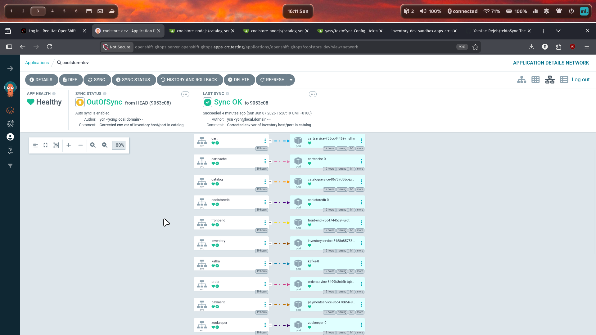
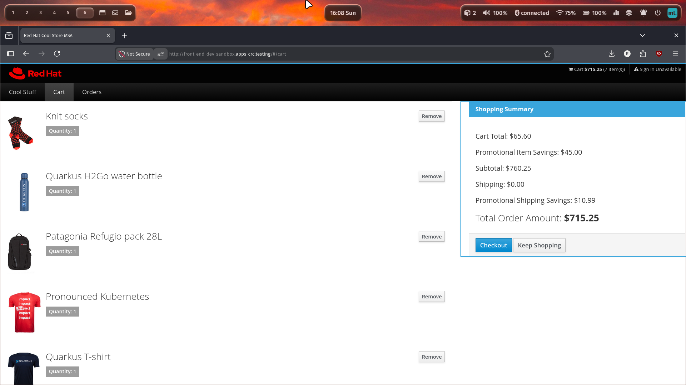
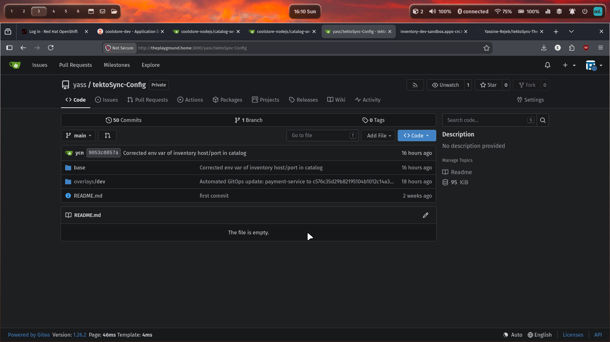

# tektoSync: The Cloud-Native Delivery Blueprint

Images:

<link rel="stylesheet" href="https://cdn.jsdelivr.net/npm/glightbox/dist/css/glightbox.min.css">
<a href="./images/argocd.jpg" class="glightbox" data-gallery="gallery1">  </a><a href="./images/ui.jpg" class="glightbox" data-gallery="gallery1">  </a><a href="./images/gitea.jpg" class="glightbox" data-gallery="gallery1">  </a>

Architecture:

- [🏗️ Architecture Overview](#-architecture-overview)
  - [Diagram](#diagram)
  - [Application Repo (`coolstore-nodejs`)](#application-repo-coolstore-nodejs)
  - [Configuration Repo (`tektoSync-Config`)](#configuration-repo-tektoSync-config)
- [💻 Infrastructure & Resource Allocation](#-infrastructure--resource-allocation)
- [📦 Application Stack Components](#-application-stack-components)
  - [Secret & Network Management](#secret--network-management)
- [🚀 The CI/CD Lifecycle](#-the-cicd-lifecycle)
  - [Continuous Integration (Tekton)](#continuous-integration-tekton)
  - [Continuous Deployment (ArgoCD)](#continuous-deployment-argocd)
- [🛠️ How to Implement](#️-how-to-implement)
  - [Phase 1: Git Repository Setup (Gitea Host)](#phase-1-git-repository-setup-gitea-host)
  - [Phase 2: OpenShift Cluster Preparation](#phase-2-openshift-cluster-preparation)
  - [Phase 3: Credential Management & Cross-Namespace Security](#phase-3-credential-management--cross-namespace-security)
  - [Phase 4: Pipeline Workspace Execution](#phase-4-pipeline-workspace-execution)
  - [Phase 5: Bootstrapping the GitOps Engine](#phase-5-bootstrapping-the-gitops-engine)
- [🛑 Post-Mortem: The CORS & Configuration Trap](#-post-mortem-the-cors--configuration-trap)
  - [Key Takeaway](#key-takeaway)

`tektoSync` is a local, end-to-end GitOps delivery blueprint that demonstrates declarative, containerized microservice delivery on Red Hat OpenShift. Built as a practical application of OpenShift platform engineering, this project bypasses vendor-locked deployment utilities (like Nodeshift) to construct a custom, standard-compliant CI/CD lifecycle for the multi-service **OG Coolstore** application.

The project features a fully local, self-hosted dual-host environment utilizing **Tekton** for Continuous Integration, **ArgoCD** for Continuous Deployment, **Kustomize** for configuration management, and **Bitnami Sealed Secrets** for GitOps-compliant secret management.

---

## 🏗️ Architecture Overview

The blueprint splits the application source code and deployment states into two isolated repositories hosted on a local, lightweight source control server, establishing a true GitOps separation of concerns.

```
                  +-----------------------------------+
                  |             Host                  |
                  |     OpenShift Local (CRC)         |
                  +-----------------------------------+
                                    ^
                                    | ArgoCD Sync
                                    | (Automated, Prune, Self-Heal)
+------------------------+          |
|          Host          |    +-----+------------+
|   Podman Components    |    |  tektoSync-      |
+------------------------+    |  Config Repo     |
|                        |    +-----+------------+
|  +------------------+  |          ^
|  |  Gitea Instance  +-------------+ Tekton Image Tag Update
|  +--------+---------+  |
|           ^            |
|           | git push   |
|  +--------+---------+  |
|  | coolstore-nodejs |  |
|  |    (App Repo)    |  |
|  +------------------+  |
+------------------------+

```

1. **Application Repo (`coolstore-nodejs`)**: Contains the core microservices, standard production Dockerfiles, and the `.tekton/` directory hosting Pipeline-as-Code definitions.
2. **Configuration Repo (`tektoSync-Config`)**: Contains the dry declarative state of the cluster managed via Kustomize (`base/` structures and a dedicated `overlays/dev` target environment).

---

## 💻 Infrastructure & Resource Allocation

To prevent OpenShift Local (CRC) from exhausting host resources, a multi-node distributed homelab strategy was implemented, offloading peripheral DevOps infrastructure to dedicated hardware.

| Host Machine | Operating System | Allocated Resources | Role / Services Managed |
| --- | --- | --- | --- |
| **Primary Host** | Fedora Workstation | 12 vCPUs, 32 GB RAM | OpenShift Local (CRC Cluster)<br><br>Allocated via: `crc start -m 18432 -c 6 -d 80` |
| **Secondary Host** | Debian 12 | 8 vCPUs, 12 GB RAM | Podman container platform hosting the **Gitea** git server |

---

## 📦 Application Stack Components

Instead of a trivial "Hello World" deployment, `tektoSync` orchestrates the complete, heavy-duty OG Coolstore ecosystem consisting of **11 distinct components** mapping stateful backend services to stateless API engines:

* **Core Microservices (Node.js):** `frontend`, `cart-service`, `catalog-service`, `inventory-service`, `order-service`, `payment-service`.
* **Stateful Backend Infrastructure:** Apache Zookeeper, Apache Kafka, Redis (`cartcache`), and MongoDB (`coolstoredb`).

### Secret & Network Management

* **Secrets:** Sealed tight using Bitnami's `kubeseal`. Plaintext database configurations and access tokens are encrypted into standard cluster-readable manifests, allowing them to be safely tracked in public/private Git configurations.
* **Networking:** OpenShift Routes were manually mapped for all 5 core microservices alongside the primary frontend. This exposes distinct host names locally, allowing the client-side browser logic to dynamically aggregate API data from across the distributed services.

---

## 🚀 The CI/CD Lifecycle

```
[ Developer Action ] ──> Manual Pipeline Trigger
                              │
                              ▼
                 +──────────────────────────+
                 |   Tekton CI Pipeline     |
                 +──────────────────────────+
                 | 1. Fetch Config Repo     |
                 | 2. Build & Push Image    |
                 | 3. Patch Kustomize Tag   |
                 +────────────┬─────────────+
                              │
                              ▼
                 +──────────────────────────+
                 |  Gitea (Config Update)   |
                 +──────────────────────────+
                              │
                              ▼
                 +──────────────────────────+
                 |   ArgoCD Reconciliation  |
                 +──────────────────────────+

```

### Continuous Integration (Tekton)

Each core microservice is mapped to a dedicated Tekton pipeline comprising three foundational tasks:

1. **Fetch Config:** Pulls down the current state of the `tektoSync-Config` repository.
2. **Build & Push:** Uses the local microservice Dockerfile to build a production container image and pushes it directly into the **OpenShift Internal Container Registry**.
3. **Patch Configuration:** Updates the corresponding image digest/tag in the Kustomize `overlays/dev` layout, committing and pushing the delta back to Gitea.

> ⚠️ **Engineering Lesson Learned:** The pipeline relies on a single shared Persistent Volume Claim (PVC) acting as its workspace. Due to the `ReadWriteOnce` (RWO) storage class nature on a single-node CRC instance, parallel execution was restricted. Pipelines must be executed sequentially to ensure clean filesystem locking across tasks.

### Continuous Deployment (ArgoCD)

ArgoCD targets the `overlays/dev` workspace path within the Gitea configuration engine and reconciliation loop.

```yaml
apiVersion: argoproj.io/v1alpha1
kind: Application
metadata:
  name: coolstore-dev
  namespace: openshift-gitops
spec:
  project: default
  source:
    repoURL: http://theplayground.home:3000/yass/tektoSync-Config.git
    targetRevision: HEAD 
    path: overlays/dev
  destination:
    server: https://kubernetes.default.svc
    namespace: dev-sandbox
  syncPolicy:
    automated:
      prune: true
      selfHeal: true
    syncOptions:
      - CreateNamespace=false

```

* **Self-Healing State:** Automated syncing with `prune: true` and `selfHeal: true` guarantees that the running environment cannot deviate from Git. Manual changes on the cluster are automatically wiped and overridden to match the repository.
* **The GitOps Handshake:** ArgoCD monitors `HEAD`. The second Tekton updates the image tags inside the configuration repository, ArgoCD intercepts the commit change, evaluates the delta, and initiates an immediate rollout.

---

## 🛠️ How to Implement

Follow this step-by-step guide to bootstrap the `tektoSync` environment across your Gitea host and OpenShift Local (CRC) cluster.

***PS:*** Make sure to remove/change the instances of http://theplayground:3000/ with the URL of your local gitea server.

### Phase 1: Git Repository Setup (Gitea Host)

1. Log into your Gitea instance and generate a **Personal Access Token (PAT)** with repository read/write permissions.
2. Create two new empty repositories named exactly:
* `coolstore-nodejs`
* `tektoSync-Config`

3. Initialize your local directories and push them to your Gitea server:
```bash
git remote add origin http://theplayground.home:3000/yass/coolstore-nodejs.git
git push -u origin main
```

### Phase 2: OpenShift Cluster Preparation

1. Create the target namespace for the application layer:
```bash
oc new-project dev-sandbox
```

2. Navigate to the OpenShift Administrator Web Console → **OperatorHub** and install:
* **Red Hat OpenShift GitOps Operator** (ArgoCD)
* **Red Hat OpenShift Pipelines Operator** (Tekton)

### Phase 3: Credential Management & Cross-Namespace Security

Because Tekton and ArgoCD run in completely different namespaces, credentials must be routed precisely.

1. **Configure Tekton CI Credentials:**
Apply the Gitea token secret to your application namespace and bind it to the default pipeline execution account:
```bash
oc apply -f gitea/gitea-creds.yaml -n dev-sandbox
oc secrets link pipeline gitea-creds --for=pull,mount -n dev-sandbox
```

2. **Configure ArgoCD CD Credentials:**
Apply the repository access credentials directly to the GitOps operator management namespace:
```bash
oc apply -f gitea/gitea-repo-creds.yaml -n openshift-gitops
```

3. **Establish Secret Encryption (Sealed Secrets):**
Install the `kubeseal` CLI utility locally. Apply the cluster permissions manifest to allow the controller to manage encrypted secrets in your namespace:
```bash
oc apply -f sealedsecrets-perms.yaml -n dev-sandbox
```

### Phase 4: Pipeline Workspace Execution

1. Provision the persistent cluster storage backend that your Tekton pipelines require to pass build context across sequential tasks:
```bash
oc apply -f tekton-workspace.yaml -n dev-sandbox
```

2. Manually trigger your Tekton pipelines via the OpenShift console or CLI to build your container images, push them to the internal registry, and auto-update the Kustomize image tags in `tektoSync-Config`.

### Phase 5: Bootstrapping the GitOps Engine

1. Launch the ArgoCD application controller by pointing it to your configuration repository blueprint:
```bash
oc apply -f gitops-app.yaml -n openshift-gitops
```

2. Monitor the ArgoCD dashboard. Wait for the stateful infrastructure components (`coolstoredb`, `cartcache`, and the Kafka cluster) to transition into a **Healthy** and **Synced** state.
3. Once Kafka is up and running, trigger the dynamic topic provisioning job:
```bash
oc apply -f createTopicsJob.yaml -n dev-sandbox
```

---

## 🛑 Post-Mortem: The CORS & Configuration Trap

The most complex operational challenge during implementation stemmed from configuring **Cross-Origin Resource Sharing (CORS)** across 6 public OpenShift cluster routes.

During the triage phase, modifications were rapidly applied to environment variables scattered between stateless deployments, statefulsets, and container build layers. Because of the sheer volume of parameters required to wire the 11 components together, an unchecked configuration drift occurred: **a single database access environment variable was missed.**

This led to a lengthy, silent API access failure debugging session. While OpenShift marked the pods as active and healthy, the application failed to bind correctly to its dependencies.

### Key Takeaway

For version 2, all environment variables should be standardized using Kustomize `ConfigMaps` or central references instead of individual deployment injections to ensure explicit scannability.

---
